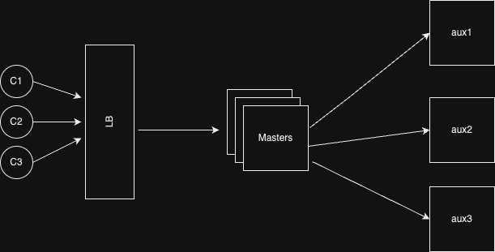

# Fault-Tolerant Distributed Caching: A Scalable Approach Through Consistent Hashing

[](https://opensource.org/licenses/MIT)
[](https://golang.org)
[](https://docker.com)

A high-performance, fault-tolerant distributed caching system implemented in Go, featuring consistent hashing for optimal data distribution, comprehensive monitoring, and automatic failure recovery mechanisms.



## 🚀 Features

### Core Functionality
- **🔄 Consistent Hashing**: Intelligent data distribution across nodes with minimal rebalancing
- **⚡ High Performance**: Optimized for low-latency cache operations
- **🛡️ Fault Tolerance**: Automatic failure detection and recovery
- **📈 Horizontal Scaling**: Easy addition/removal of nodes without downtime
- **🔒 Thread Safety**: Concurrent request handling with proper synchronization

### Caching & Storage
- **💾 LRU Cache**: Efficient Least Recently Used eviction policy
- **⏰ TTL Support**: Time-to-live for cache entries
- **💽 Persistent Backups**: Automatic data backup and restoration
- **🔄 Data Rebalancing**: Automatic redistribution during topology changes

### Monitoring & Observability
- **📊 Prometheus Metrics**: Comprehensive performance monitoring
- **📈 Grafana Dashboards**: Real-time visualization and alerting
- **🏥 Health Checks**: Continuous service health monitoring
- **📝 Detailed Logging**: Comprehensive request and operation logging

### Deployment & DevOps
- **🐳 Docker Support**: Full containerization with Docker Compose
- **⚖️ Load Balancing**: NGINX-based request distribution
- **🧪 Load Testing**: Built-in performance testing with Locust
- **🔧 Easy Configuration**: Environment-based configuration management

## 🏗️ Architecture

### System Components

```
┌─────────────┐    ┌─────────────┐    ┌─────────────┐
│   Client    │    │   Client    │    │   Client    │
└──────┬──────┘    └──────┬──────┘    └──────┬──────┘
       │                  │                  │
       └──────────────────┼──────────────────┘
                          │
                   ┌──────▼──────┐
                   │ Load Balancer│
                   │   (NGINX)    │
                   └──────┬──────┘
                          │
            ┌─────────────┼─────────────┐
            │             │             │
     ┌──────▼──────┐ ┌────▼────┐ ┌──────▼──────┐
     │  Master-1   │ │Master-2 │ │  Master-3   │
     │  (8000)     │ │ (8000)  │ │  (8000)     │
     └──────┬──────┘ └────┬────┘ └──────┬──────┘
            │             │             │
            └─────────────┼─────────────┘
                          │
              ┌───────────┼───────────┐
              │           │           │
       ┌──────▼──────┐ ┌──▼──┐ ┌──────▼──────┐
       │    Aux-1    │ │Aux-2│ │    Aux-3    │
       │   (3001)    │ │(3002)│ │   (3003)    │
       └─────────────┘ └─────┘ └─────────────┘
```

### Key Components

1. **Load Balancer (NGINX)**: Distributes client requests across multiple master nodes
2. **Master Servers**: Handle client requests and coordinate cache operations using consistent hashing
3. **Auxiliary Servers**: Store cached data with LRU eviction and local backup capabilities
4. **Monitoring Stack**: Prometheus + Grafana for metrics collection and visualization
5. **Service Discovery**: ZooKeeper for node registration and health monitoring

## 📋 Prerequisites

- Docker & Docker Compose
- Go 1.21+ (for development)
- Git

## 🚀 Quick Start

### 1. Clone the Repository
```bash
git clone https://github.com/MohanSatyaPavan2005/Fault-Tolerant-Distributed-Caching-A-Scalable-Approach-Through-Consistent-Hashing.git
cd Fault-Tolerant-Distributed-Caching-A-Scalable-Approach-Through-Consistent-Hashing
```

### 2. Deploy with Docker Compose
```bash
# Build and start all services
docker-compose up --build -d

# Verify all services are running
docker-compose ps

# View logs
docker-compose logs -f
```

### 3. Verify Installation
```bash
# Check system health
curl http://localhost:8081/health

# Test cache operations
curl -X PUT "http://localhost:8081/cache/?key=test&value=hello"
curl "http://localhost:8081/cache/?key=test"
```

## 🔧 Configuration

### Environment Variables

| Service | Variable | Description | Default |
|---------|----------|-------------|---------|
| **Master** | PORT | HTTP server port | 8000 |
| | REPLICATION_FACTOR | Virtual nodes per physical node | 10 |
| | HEALTH_CHECK_INTERVAL | Health check frequency (seconds) | 10 |
| | BACKUP_INTERVAL | Backup frequency (seconds) | 120 |
| **Auxiliary** | PORT | HTTP server port | 3001-3003 |
| | MASTER_ADDRESS | Master server endpoint | nginx:80 |
| | CACHE_SIZE | Maximum cache entries | 1000 |
| | BACKUP_DIR | Backup storage directory | /app/backup |
| | BACKUP_INTERVAL | Backup frequency (seconds) | 60 |

### Scaling Configuration

To add more auxiliary servers:

```yaml
# Add to docker-compose.yml
aux4:
  build:
    context: .
    dockerfile: Dockerfile
    args:
      SERVER_TYPE: auxiliary
  environment:
    - PORT=3004
    - MASTER_ADDRESS=nginx:80
    - CACHE_SIZE=1000
  volumes:
    - aux4-data:/app/backup
  networks:
    - cache-net
```

## 📡 API Reference

### Cache Operations

| Endpoint | Method | Description | Example |
|----------|--------|-------------|---------|
| `/cache/` | PUT | Store key-value pair | `PUT /cache/?key=user1&value=data` |
| `/cache/` | GET | Retrieve value by key | `GET /cache/?key=user1` |

### System Management

| Endpoint | Method | Description |
|----------|--------|-------------|
| `/health` | GET | Service health status |
| `/metrics` | GET | Prometheus metrics |

### Example Usage

```bash
# Store data
curl -X PUT "http://localhost:8081/cache/?key=user:123&value=john_doe"

# Retrieve data
curl "http://localhost:8081/cache/?key=user:123"

# Check health
curl "http://localhost:8081/health"

# View metrics
curl "http://localhost:8081/metrics"
```

## 📊 Monitoring & Observability

### Prometheus Metrics (Port 9090)
Access at: http://localhost:9090

**Key Metrics:**
- `cache_operations_total`: Total cache operations by type and result
- `cache_request_duration_seconds`: Request latency distribution
- `cache_size_current`: Current cache size
- `server_uptime_seconds`: Server uptime

### Grafana Dashboards (Port 4000)
Access at: http://localhost:4000 (admin/admin)

**Dashboard Features:**
- Real-time cache performance metrics
- System resource utilization
- Request rate and latency trends
- Node health status
- Error rate monitoring

### Sample Prometheus Queries

```promql
# Cache hit rate
rate(cache_operations_total{result="hit"}[5m]) / rate(cache_operations_total{operation="get"}[5m])

# Average request latency
rate(cache_request_duration_seconds_sum[5m]) / rate(cache_request_duration_seconds_count[5m])

# Cache operations per second
rate(cache_operations_total[5m])
```

## 🧪 Load Testing

The system includes comprehensive load testing capabilities using Locust.

### Running Load Tests

```bash
# Navigate to load test directory
cd load_test

# Run interactive load test
./run_test.sh

# Run headless load test
./run_test.sh --host http://localhost:8081 --users 200 --rate 20 --time 10m --headless

# Custom test scenarios
python -m locust -f locustfile.py --host=http://localhost:8081
```

### Load Test Options

| Parameter | Description | Default |
|-----------|-------------|---------|
| `--host` | Target host URL | http://localhost:8081 |
| `--users` | Concurrent users | 100 |
| `--rate` | User spawn rate/sec | 10 |
| `--time` | Test duration | 5m |
| `--headless` | Run without UI | false |

## 🔄 Fault Tolerance & Recovery

### Automatic Recovery Mechanisms

1. **Health Monitoring**: Continuous health checks on all nodes
2. **Failure Detection**: Automatic detection of node failures
3. **Data Rebalancing**: Redistribution of data when topology changes
4. **Backup & Restore**: Periodic backups with automatic restoration
5. **Circuit Breaking**: Prevents cascade failures

### Recovery Scenarios

| Scenario | System Response |
|----------|----------------|
| **Single Node Failure** | Detect failure → Rebalance data → Continue operations |
| **Master Node Failure** | Load balancer routes to healthy masters |
| **Network Partition** | Isolate affected nodes → Serve from healthy partition |
| **Complete System Restart** | Restore from backups → Rebuild hash ring |

### Manual Recovery Commands

```bash
# Trigger manual backup
curl -X POST http://localhost:8081/backup

# Force rebalancing
curl -X POST http://localhost:8081/rebalance

# Check node status
curl http://localhost:8081/nodes
```

## 🛠️ Development

### Local Development Setup

```bash
# Install dependencies
go mod tidy

# Run tests
go test ./...

# Run master server locally
go run main.go

# Run auxiliary server locally
go run cmd/auxiliary/main.go
```

### Project Structure

```
├── cmd/
│   ├── auxiliary/          # Auxiliary server main
│   └── master/             # Master server main
├── internal/
│   ├── cache/              # LRU cache implementation
│   └── hashing/            # Consistent hashing
├── pkg/
│   ├── metrics.go          # Prometheus metrics
│   └── models/             # Data models
├── config/
│   ├── nginx/              # Load balancer config
│   ├── prometheus/         # Monitoring config
│   └── grafana/            # Dashboard config
├── load_test/              # Performance testing
├── docker-compose.yml      # Container orchestration
└── Dockerfile             # Multi-stage container build
```

### Testing

```bash
# Unit tests
go test ./internal/...

# Integration tests
go test ./pkg/...

# Load testing
cd load_test && ./run_test.sh

# Docker testing
docker-compose up --build
```

## 🔮 Future Enhancements

- [ ] **Data Replication**: Multi-replica support with consensus
- [ ] **Authentication**: API key and JWT-based auth
- [ ] **Compression**: Data compression for memory efficiency
- [ ] **Multi-tenancy**: Namespace isolation
- [ ] **Advanced Eviction**: Multiple eviction policies
- [ ] **Clustering**: Multi-region deployment support
- [ ] **Streaming**: Real-time data streaming capabilities

## 🤝 Contributing

We welcome contributions! Please follow these steps:

1. Fork the repository
2. Create a feature branch (`git checkout -b feature/amazing-feature`)
3. Commit your changes (`git commit -m 'Add amazing feature'`)
4. Push to the branch (`git push origin feature/amazing-feature`)
5. Open a Pull Request

### Development Guidelines

- Follow Go best practices and formatting standards
- Add unit tests for new functionality
- Update documentation for API changes
- Ensure Docker builds complete successfully

## 📄 License

This project is licensed under the MIT License - see the [LICENSE](LICENSE) file for details.

## 🙏 Acknowledgments

- Go community for excellent libraries and tools
- Prometheus and Grafana teams for monitoring solutions
- Docker for containerization platform
- NGINX for load balancing capabilities

## 📞 Support

- 📧 Email: mmspavanthegoblin@gmail.com
- 🐛 Issues: [GitHub Issues](https://github.com/MohanSatyaPavan2005/Fault-Tolerant-Distributed-Caching-A-Scalable-Approach-Through-Consistent-Hashing/issues)
- 📖 Documentation: [Wiki](https://github.com/MohanSatyaPavan2005/Fault-Tolerant-Distributed-Caching-A-Scalable-Approach-Through-Consistent-Hashing/wiki)

---

⭐ **Star this repository if you find it helpful!**
